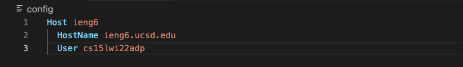
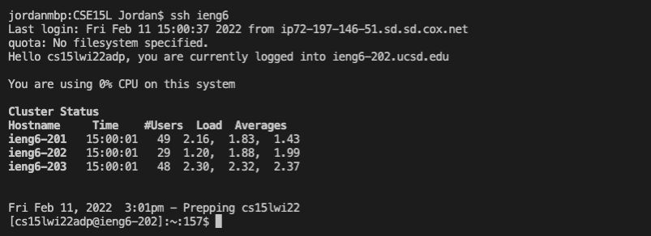
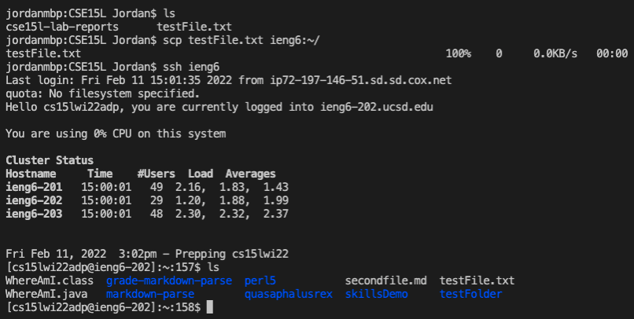

# **WEEK 6 LAB REPORT**
**Jordan Peranginangin (PID: A16798626)**

## **STREAMLINING SSH CONFIGURATION**

This is a screenshot of my .ssh/config file. I first navigated to the root directory using cd. I then used cd a second time to navigate into the .ssh directory. From there, I opened up the existing config file in VScode and edited the lines to match the example shown in the week 5 lab. 

---

Once the .ssh/config file was setup, I tested an ssh command using the alias. Instead of using ssh cs15lwi22adp@ieng6.ucsd.edu, I was able to use ssh ieng6 instead. This is a simpler and more efficient way to ssh into my remote account.

---

I can also use the alias to make scp commands more efficient. In the screenshot above, I created a file called testFile.txt in a folder called CSE15L. I then used scp using the alias to copy testFile.txt to my remote account. I then checked that the file was successfully copied by logging into the remote account and using the list command. 
