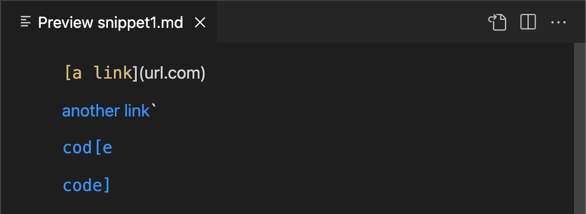

# **WEEK 8 LAB REPORT**
**Jordan Peranginangin (PID: A16798626)**

[My markdown-parse repository](https://github.com/jordanangin/cse15l-lab-reports)

[Eric Pei's markdown-parse repository](https://github.com/ericwpei/markdown-parse)

## **SNIPPET 1**

Based on the screenshot above, the getLinks() method should grab three links. The method should return: 
```
[`google.com, google.com, ucsd.edu]
```
The JUnit test for my implementation of markdown-parse failed:


The JUnit test for Eric's implementation of markdown-parse failed:

## **SNIPPET 2**

Based on the screenshot above, the getLinks() method should grab three links. The method should return: 
```
[a.com, a.com((, example.com]
```
The JUnit test for my implementation of markdown-parse passed.

The JUnit test for Eric's implementation of markdown-parse failed:

## **SNIPPET 3**

Based on the screenshot above, the getLinks() method should grab three links. The method should return: 
```
[https://www.twitter.com, https://ucsd-cse15l-w22.github.io/, https://cse.ucsd.edu/]
```
The JUnit test for my implementation of markdown-parse failed:


The JUnit test for Eric's implementation of markdown-parse failed:


## **Concluding Questions**
1. I believe there exists a solution that is less than 10 lines of code that will work for Snippet 1 and all related cases that use inline code with backticks. In order to fix this issues, the code needs to remove any backticks that are found between an open and closing parenthesis. This can be done by calling indexOf("`") on the substring between the opening and closing parenthesis. Using a while loop, keep removing backticks until no more backticks exist within the link.
2. Although my implementation of markdown-parse.java worked for Snippet 2, I do not think there exists a solution that is less than 10 lines of code that will work for more complicated cases that use nested parentheses, brackets, and escaped brackets. In order to check for nested parenthesis, brackets, and escaped brackets we would have to examine the markdown file line by line. This is fundamental change which requires a complete rebuild of markdown-parse.java. Once the code looks at the markdown file line by lines, we can program logic to find the first opening bracket/parenthesis and the last closing bracket/parenthesis. This logic could be extremely complex. However, once this logic is in place, we can use the indexes of the opening and closing brackets/parentheses to return the correct links.
3. I believe there exists a solution that is less than 10 lines of code that will work for Snippet 3 and all related cases that have newlines in brackets and parenthesis. My implementation of markdown-parse.java does not break when there are newlines between brackets/parenthesis. In Snippet 3, the issue was that the second link did not have a closing parenthesis. This caused my code to treat everything between the second opening parenthesis and the next closing parenthesis as a link. To fix this, the code needs to check if there exists a closing parenthesis before the next bracket. This check can be done in less than 10 lines of code.