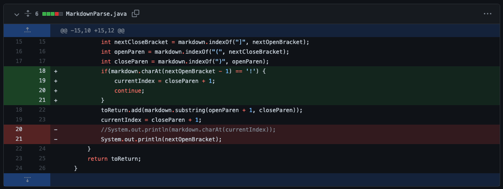
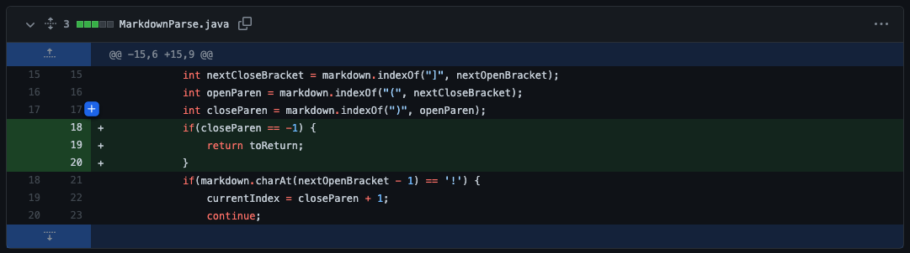
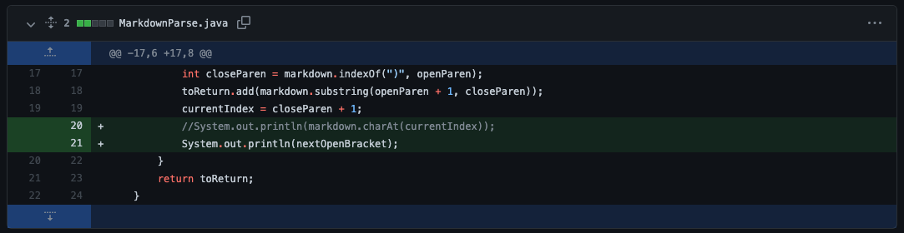

# **WEEK 4 LAB REPORT**
**Jordan Peranginangin (PID: A16798626)**

## **CODE CHANGE #1 (File w/ Image)**

[Link to Test File](https://github.com/jordanangin/markdown-parse/blob/main/image.md?plain=1)
```
$ java MarkdownParse image.md
[google.com, fake.png]
```
The symptom was that the getLinks() function was returning both the link and image when the desired result was just the link. The bug that caused this symptom was that the getLinks() could not differentiate a markdown link from an image. The failure-inducing input was the image.md file that included both a link and an image.


## **CODE CHANGE #2 (Missing Parenthesis)**

[Link to Test File](https://github.com/jordanangin/markdown-parse/blob/main/incorrect.md?plain=1)
```
$ java MarkdownParse incorrect.md
Exception in thread "main" java.lang.StringIndexOutOfBoundsException: begin 16, end -1, length 26
```
The symptom was that the terminal was displaying an IndexOutOfBoundsException. The bug that caused this symptom was that substring() was called with the ending index being -1. The failure-inducing input was the incorrect.md file that included both a link wihtout the closing parenthesis at the end.


## **CODE CHANGE #3 (Infinite Loop)**

[Link to Test File](https://github.com/jordanangin/markdown-parse/blob/main/newfile.md?plain=1)
```
$ java MarkdownParse newfile.md
64
-1
64
-1
64
-1
64
-1
```
The symptom was that the terminal was printing out 64 and -1 in an infinte loop. The bug that caused nextOpenBracket to alternate between -1 and 64 indefinitely was that the code was trying to find nextOpenBracket after the closing parenthesis in the link. Because it didn't exist, nextOpenBracket was set to -1 and the currentIndex changed resulting in 64 being the next value of nextOpenBracket. The failure-inducing input was the newfile.md file that included a link with a set of parenthesis at the end.