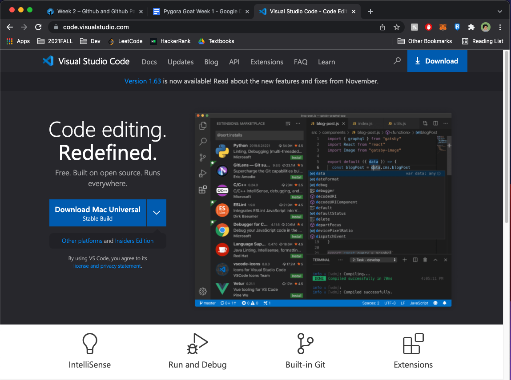
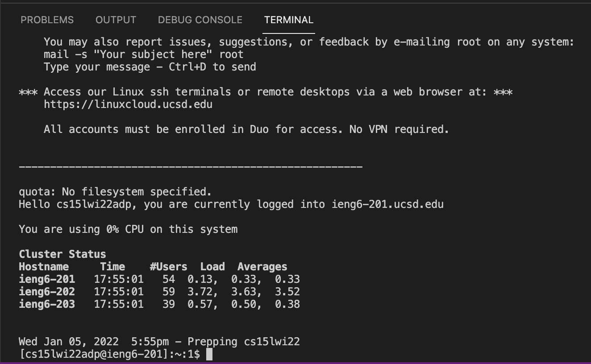
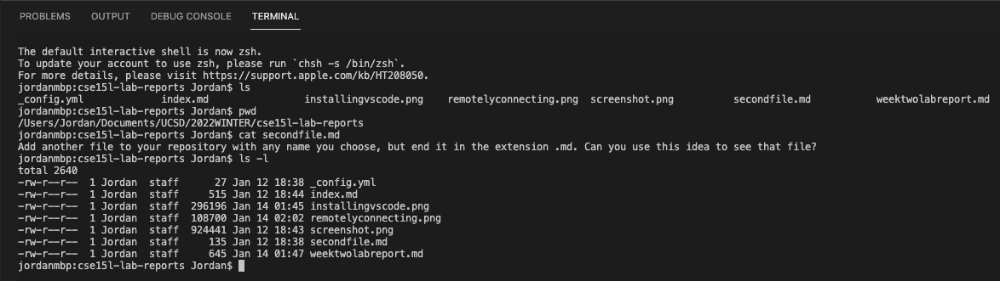
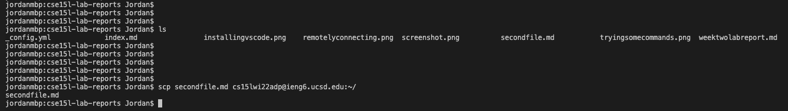
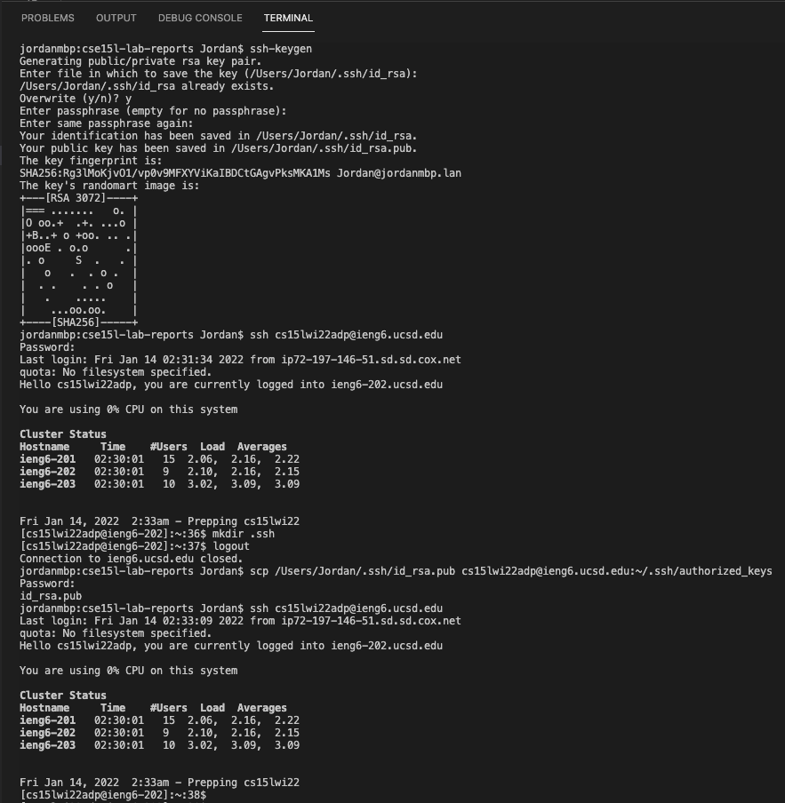
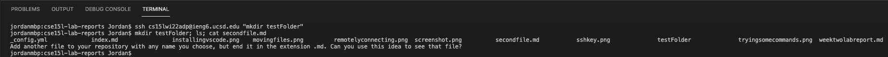

# **WEEK 2 LAB REPORT (REMOTE ACCESS)**
**Jordan Peranginangin (PID: A16798626)**

## **INSTALLING VSCODE**
- Before any programming, an integrated development environment must be installed. For this course, we will be using Visual Studio Code. You can find the download link here:   

    [https://code.visualstudio.com/](https://code.visualstudio.com/).  

    On MacOS systems, hit download and drag the application to the "applications" folder. All you need now is to open the application and hit allow on any security prompts that may pop-up.

    
## **REMOTELY CONNECTING**
- This section will cover how to remotely connect to a UCSD course-specific acccount on ieng6. Because I use a MacBook Pro, I didn't need to install OpenSSH; if you are using a Windows machine you will need to install [OpenSSH](https://docs.microsoft.com/en-us/windows-server/administration/openssh/openssh_install_firstuse). The next step is to change the password to your course-specific account here:

    [Change Password Here](https://sdacs.ucsd.edu/~icc/index.php)

    The final step is to open terminal in Visual Studio Code and run the following command (change "adp" to match your account name):

    ```
    $ ssh cs15lwi22adp@ieng6.ucsd.edu
    ```

    Once you hit enter, the terminal should prompt you for the password that you just reset. Don't worry if no characters show up when you type, the terminal does that to ensure your privacy. After that you should see a quick log that displays some useful information:

    

    If you see something like this, congratulations! You've connected remotely to ieng6! 
## **TRYING SOME COMMANDS**
- Now that you have Visual Studio Code setup and you know how to connect remotely to a server, it's time to learn some terminal commands. Here is a list of commands you can use:
    ```
    $ ls (shows files)
    $ ls -l (shows files with additional information)
    $ mkdir (makes a folder)
    $ cd (changes directory)
    $ pwd (prints working directory)
    $ cp (used to copy files)
    $ cat (prints the contents of a file)
    ```

    Here is a screenshot that showcases me using some of these commands within the built-in Visual Studio Code terminal:

    
## **MOVING FILES WITH SCP**
- Another useful terminal command is scp. This commands enables you to copy files from a local computer to a remote server. In this case, we will be copying files from a local computer to ieng6. Using "cd", change directories to where the file is located. Here is the command you need to run: 
    ```
    $ scp nameOfFile.java cs15lwi22adp@ieng6.ucsd.edu:~/
    ```

    Make sure to swap out "adp" to match your account name. After hitting enter, the terminal should prompt for a password and the file will be copied over to the remote computer. 

    
## **SETTING AN SSH KEY**
- If you pay close attention to the screenshot from the previous section, you can see that the terminal did not ask for my password. That's because I already setup an SSH key which serves as a form of authentication. In other words, I don't need to type-in my password over and over again when I want to interact with the remote server. 

    Run the following command in your terminal:
    ```
    $ ssh-keygen
    ```

    Once this is done, you should now have a public and private key. We will now copy the public key into a folder called ".ssh" which needs to be made on the remote computer. Here is a screenshot that outlines the entire process: 

    
## **OPTIMIZING REMOTE RUNNING**
- This last section is about tricks/shortcuts that can shorten tedious processes of running programs remotely. 

    The first trick is that you can use quotation marks around commands and place them after an ssh command to run the command on the remote computer and exit once it's finished. This command will log into the server, make a folder called testFolder, and then logout. 
    ```
    $ ssh cs15lwi22adp@ieng6.ucsd.edu "mkdir testFolder"
    ```

    The second trick is that multiple terminal commands can be run on the same line if they are separated by semicolons. This command will make a folder, list the contents of the current directory, and print out the contents of a file:
    ```
    $ mkdir testFolder; ls; cat secondfile.md
    ```

    The final trick is that you can use the up and down arrow keys to cycle through commands that were previously run in the terminal. This will definitely save you some time if you need to copy and paste commands into the terminal.

    